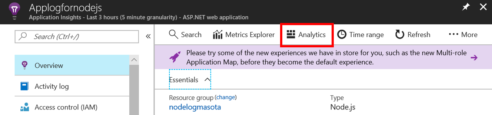
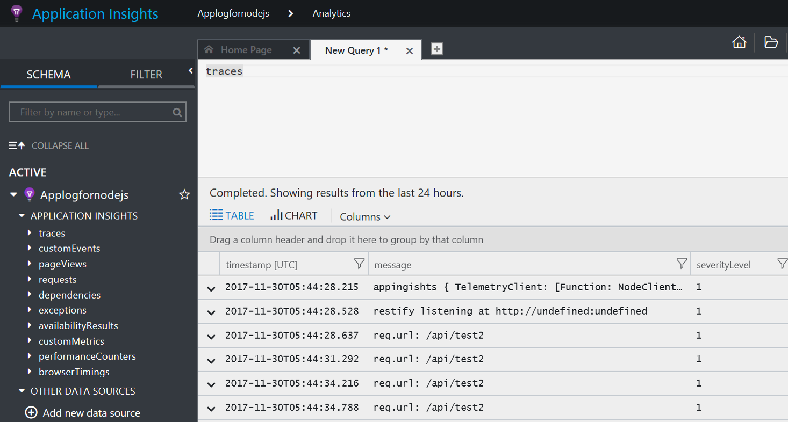

# Node.js on Azure
Research and describe `How to host production node.js app on Azure`.

## Motivation
I and my customer have node.js app on Azure, and sometimes we can't find following infromation.. To solve this situation, I started this repo.
- Logging (How to collect log from node.js App on Web Apps)
- CI/CD (How to automate node.js deployment using dev/staging/production slots)

If you have other challenges for hosting node.js app on Azure, let's discuss and collaborate through issue and pull request.

## Prerequistics
- You have Azure subscription (If you don't have, please create it [here](https://azure.microsoft.com/en-us/free/) free)
- You can undersntad node.js development
- I expect you uses Web Apps for hosting node.js app

## Table of Contents
- How to store application log
- CI/CD (coming soon)

# How to store Application log
My favorite way to store and analyze log is using [Application Insights](https://azure.microsoft.com/en-us/services/application-insights/). It automatically collect request, dependency and logs. Then these information is visualized such as
- How may request and how many errors
- How long to fetch data from db and API
- What kind of error occured with external API (401, 403 and sometimes.. 5xx)

I really love this because it's easy to use and can start from free. At least, it is easier than grep command to analyze log XD.

## Start with Application Insights
Microsoft published good [starter document](https://docs.microsoft.com/en-us/azure/application-insights/app-insights-nodejs#telemetryclient-api). Pleae follow this at first.

You need to get instrumention Key for using Application Insights. You may not want to do hardcoding in your source. If so, please use following technig.

1. Code `process.env.APPINSIGHTS_INSTRUMENTATIONKEY` in your node for getting environmental variable.
2. Set environmental variable in your dev machine.
    1. Bash: export APPINSIGHTS_INSTRUMENTATIONKEY="Your key"
    2. Windows (cmd): set APPINSIGHTS_INSTRUMENTATIONKEY="Your key"
3. Type `node app.js` for local debug
4. For production environment, you may use Azure Web Apps. Web Apps can store environmental variable in [Application settings]-[App settings]. This is key-value store. The left side is for key and right side is for value, so please input `APPINSIGHTS_INSTRUMENTATIONKEY` in left side and input your application insight instrument key in right side like the image.


## How to enable console.log() in Application Insights SDK
Developers tend to use console.log for logging in local environment and may want to do logging without any code changes. Application Insights doesn't collect it default as described [this document](https://github.com/Microsoft/ApplicationInsights-node.js/).
>by default setAutoCollectConsole is configured to **exclude calls to console.log** (and other console methods). By default, only calls to supported third-party loggers (e.g. winston, bunyan) will be collected. **You can change this behavior to include calls to console methods by using setAutoCollectConsole(true, true)**.

If you want to see console.log() logg in Application Insights, please write the code like below.
```javascript
appInsights.setup(process.env.APPINSIGHTS_INSTRUMENTATIONKEY)
    .setAutoCollectConsole(true,true)//It enables console.log() logging
    .start();
```

Please deploy it Azure. OK, let's see our logs.
1. Go to Application Insights in Azure portal
2. Click [Analytics] in [Overview] blade

3. Click [+] button and create new tab
4. Type `traces` and click [Go]button


Conguratulations! You can see your logs. You can also write sql-like command like
`traces | where message contains "test2"` to filter logs. It may be easier than grep command.

# memo: Will add some documents..
1. Local Git Repository
2. CI/CD
3. How to backup application Insights log

need to click [Essentials]tab in [Overview]blade to see `Instrumentation Key` in Azure portal
